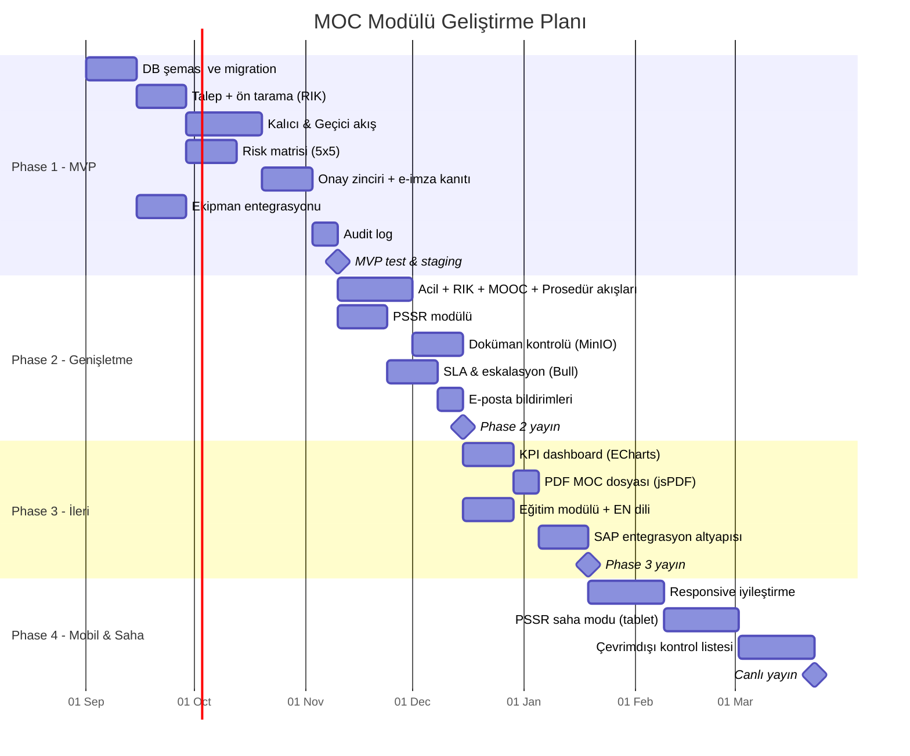

# MOC (Management of Change) Yönetim Sistemi — Teknik Taslak v2

> **Kapsam:** Endüstriyel / PSM tabanlı, işletmedeki **tüm değişiklikleri** (ekipman, proses, kimyasal/hammadde, prosedür, organizasyon, proje, yeni ürün geliştirme) yöneten Değişiklik Yönetimi
> **Entegrasyon:** Mevcut Ekipman Yönetimi uygulamasıyla **aynı veritabanını paylaşan, ana menüde bağımsız bir modül** (ekipman menüsünün altında değil)
> **Platform:** qdataline.com üzerinde çok kiracılı (multi-tenant) SaaS, web tabanlı
> **Referans standartlar:** OSHA 29 CFR 1910.119(l), EPA RMP, Seveso III, ISO 45001, ISO 9001 (değişiklik kontrolü)

---

## 1. Proje Özeti

Fiziksel ekipman, proses, kimyasal, prosedür ve organizasyon değişikliklerini uçtan uca yöneten,
risk değerlendirme (HAZOP/What-If), PSSR (Devreye Alma Öncesi Güvenlik İncelemesi), geçici değişiklik
süre takibi ve tam denetim izi (audit trail) içeren MOC modülü. Mevcut Ekipman Yönetimi uygulamasının
kimlik doğrulama, tenant ve ekipman kayıtlarını doğrudan kullanır.

---

## 2. Teknoloji Stack (Mevcut Projeyle Uyumlu)

| Katman | Teknoloji | Not |
|---|---|---|
| Backend | Node.js + Express (REST API) | Mevcut API'ye `/api/moc/*` route grubu |
| Frontend | React.js + TypeScript | Mevcut uygulamada yeni modül/menü |
| Veritabanı | PostgreSQL (multi-tenant, RLS) | **Mevcut DB — yeni tablolar `moc_` öneki ile** |
| Cache | Redis | SLA sayaçları, oturum, bildirim kuyruğu |
| Kuyruk | Bull Queue | Hatırlatma, süre dolumu, e-posta işleri |
| Dosya | MinIO (S3 uyumlu) | P&ID, çizim, sertifika ekleri |
| Raporlama | Apache ECharts + jsPDF | KPI dashboard, PDF MOC dosyası çıktısı |
| Deployment | Docker + Docker Compose | Mevcut compose dosyasına servis eklenmez; aynı backend imajı |

---

## 3. Modül Konumlandırma: Bağımsız + Entegre Edilebilir

Q-MOC **kendi başına satılabilir bağımsız bir üründür**; Ekipman Yönetimi'ne bağımlı değildir.

- **Konum:** Ana navigasyonda bağımsız modül; Ekipman Yönetimi ile aynı seviyede.
- **Kod bağımsızlığı:** `src/modules/moc/` ekipman modülü kodunu import etmez. Ekipman modülü olmadan derlenir ve çalışır.
- **Ortak çekirdek:** Yalnız platform çekirdeği paylaşılır: `tenant`, `users`, kimlik doğrulama. Bu, tüm Qdataline modüllerinin (kimyasal, sarf, MOC) ortak SaaS temelidir.
- **Lisans bayrağı:** `tenant_modules` tablosu tenant bazında hangi modüllerin açık olduğunu tutar.
- **Ekipman bağlantısı (yumuşak referans):**
  - Ekipman modülü **lisanslıysa:** MOC talebinde ekipman seçici aktif, `moc_equipment.equipment_id` koşullu FK ile bağlanır; ekipman kartında MOC sekmesi görünür.
  - Ekipman modülü **yoksa (standalone satış):** Aynı alan serbest metin `asset_ref` ("P-101" gibi tag no) olarak çalışır; hiçbir fonksiyon kaybı olmaz.
  - Kategori bazlı zorunluluk (`requires_equipment_link`) yalnız Ekipman kategorisinde ve yalnız modül lisanslıyken uygulanır.
- **Ekipman kartında MOC sekmesi:** Ekipman detay sayfasında o ekipmana ait geçmiş/açık MOC listesi.
- **Çift yönlü tetikleme:** MOC kapanışında ekipman ana verisi (tag, kapasite, malzeme vb.) güncelleme
  görevi otomatik oluşturulur; ekipman değişikliği MOC olmadan kaydedilemez (yapılandırılabilir kural).
- **RBAC:** Mevcut rol altyapısına MOC izin seti (`moc.create`, `moc.approve`, `moc.pssr` …) eklenir.

---

## 4. Değişiklik Kapsamı: Kategori × Akış Modeli

İyi uygulamada **kategori** (neyin değiştiği) ile **akış türü** (nasıl yönetildiği) ayrı alanlardır.
Her talepte ikisi birden seçilir; risk analizi ve onay zinciri bu kombinasyona göre şekillenir.

### Değişiklik Kategorileri (8 kategori)

| # | Kategori | Örnek | Özel Gereksinim |
|---|---|---|---|
| 1 | **Ekipman** | Pompa modifikasyonu, kapasite artışı | Ekipman kaydına zorunlu bağlantı |
| 2 | **Proses** | Basınç/sıcaklık parametresi, akış şeması değişimi | P&ID revizyon takibi |
| 3 | **Kimyasal / Hammadde** | Yeni hammadde, tedarikçi kaynaklı spek değişimi | SDS/MSDS kontrolü, uyumluluk analizi |
| 4 | **Yeni Ürün Geliştirme** | Yeni ürün reçetesi, formülasyon, deneme üretimi | Kalite onayı (ISO 9001 tasarım kontrolü), deneme üretim planı |
| 5 | **Proje** | Yeni hat kurulumu, tesis genişletme, revamp | Proje fazlarına bağlı çoklu MOC, devreye alma planı |
| 6 | **Prosedür / Doküman** | Talimat, işletme prosedürü revizyonu | Sürüm kontrolü + eğitim |
| 7 | **Organizasyonel** | Vardiya, sorumluluk, kadro değişimi | Yetkinlik/eğitim etki analizi |
| 8 | **Yazılım / Otomasyon** | DCS/PLC parametre, kontrol mantığı değişimi | Fonksiyonel test + yedekleme kanıtı |

## 5. Akış Türleri (6 Akış — PSM Tabanlı)

| # | Akış | Açıklama | Özel Kural |
|---|---|---|---|
| 1 | **Kalıcı Değişiklik (Permanent)** | Ekipman/proses üzerinde kalıcı modifikasyon | Tam risk analizi + PSSR zorunlu |
| 2 | **Geçici Değişiklik (Temporary)** | Süreli by-pass, geçici hat, geçici ekipman | **Bitiş tarihi zorunlu**; süre dolmadan uyarı, dolunca otomatik eskalasyon; uzatma onayla |
| 3 | **Acil Değişiklik (Emergency)** | Üretim durması / güvenlik riski anında | Sözlü ön onay + 24-72 saat içinde geriye dönük tam MOC dosyası |
| 4 | **Birebir Yenileme (Replacement-in-Kind, RIK)** | Aynı spesifikasyonda parça değişimi | Tarama formu ile MOC muafiyeti; kayıt tutulur, tam akış gerekmez |
| 5 | **Organizasyonel Değişiklik (MOOC)** | Personel, vardiya, sorumluluk değişimi | Yetkinlik/eğitim etki analizi zorunlu |
| 6 | **Prosedürel / Doküman Değişikliği** | İşletme prosedürü, talimat, P&ID revizyonu | Doküman sürüm kontrolü + eğitim bildirimi |

### Ortak Akış Adımları
`Talep → Ön Tarama (RIK mi?) → Sınıflandırma & Risk Değerlendirme → Teknik İnceleme → Onay(lar) → Uygulama & Aksiyonlar → Doküman Güncelleme → Eğitim/Bilgilendirme → PSSR → Devreye Alma → Kapanış → (Geçicide) Süre Takibi & Eski Duruma Dönüş`

---

## 6. Roller (8 Rol)

1. **Sistem Yöneticisi** — tenant, rol, akış konfigürasyonu
2. **Talep Sahibi (Initiator)** — her kullanıcı MOC başlatabilir
3. **MOC Koordinatörü** — tarama, sınıflandırma, akış yönlendirme, kapanış kontrolü
4. **Alan/Bölüm Sorumlusu** — etkilenen ünite adına teknik görüş
5. **HSE / İSG Uzmanı** — risk değerlendirme onayı, İSG etki analizi
6. **Teknik İnceleme Ekibi (Mühendislik/Bakım)** — tasarım ve uygunluk incelemesi
7. **Onay Otoritesi (Tesis/İşletme Müdürü)** — risk seviyesine göre kademeli nihai onay
8. **PSSR Ekibi** — devreye alma öncesi saha kontrolü ve serbest bırakma

---

## 7. Veritabanı Tabloları (mevcut DB'ye eklenecek, `moc_` öneki)

1. `moc_requests` — talep ana kaydı (**kategori + akış türü**, durum, öncelik, tenant_id, initiator)
2. `moc_types` — akış tanımları ve adım konfigürasyonu (tenant bazlı özelleştirme)
3. `moc_equipment` — MOC ↔ mevcut `equipment` ilişki tablosu (N:N)
4. `moc_risk_assessments` — 5×5 risk matrisi, HAZOP/What-If kayıtları, önce/sonra risk skoru
5. `moc_approvals` — kademeli onay zinciri, e-imza kanıtı (kullanıcı + zaman damgası + hash)
6. `moc_action_items` — aksiyon/görevler, sorumlu, termin, SLA durumu
7. `moc_pssr_checklists` — PSSR şablonları ve doldurulmuş kontrol listeleri
8. `moc_documents` — ekler ve etkilenen doküman listesi (P&ID, prosedür) + sürüm no
9. `moc_trainings` — bilgilendirme/eğitim kayıtları, katılım onayı
10. `moc_temporary_tracking` — geçici değişiklik bitiş tarihi, uzatma geçmişi, kapanış durumu
11. `moc_notifications` — bildirim kayıtları (uygulama içi + e-posta)
12. `moc_audit_log` — tüm alan değişikliklerinin değiştirilemez izi (append-only)

> `users`, `tenant` ve `equipment` tabloları mevcut projeden kullanılır — kopyalanmaz.

---

## 8. Modüller (12 Modül)

1. **Kimlik & RBAC** — mevcut auth'a MOC izin seti eklenmesi
2. **Talep & Ön Tarama** — RIK tarama formu, tür otomatik önerisi
3. **Workflow Motoru** — 6 akış, tenant bazlı adım konfigürasyonu, koşullu dallanma (risk skoruna göre onay seviyesi)
4. **Risk Değerlendirme** — 5×5 matris, HAZOP/What-If şablonları, kalıntı risk takibi
5. **Onay & E-İmza** — kademeli onay, vekâlet (delegation), onay kanıtı (hash + zaman damgası)
6. **Aksiyon & SLA Yönetimi** — termin, hatırlatma, ihlal eskalasyonu (Bull Queue)
7. **PSSR Modülü** — şablon yönetimi, saha kontrol listesi, serbest bırakma kaydı
8. **Doküman Kontrolü** — etkilenen doküman listesi, sürüm takibi, MinIO ekleri
9. **Eğitim & Bilgilendirme** — etkilenen personel listesi, "okudum-anladım" onayı
10. **Geçici Değişiklik Takibi** — süre sayacı, T-7/T-1 uyarıları, otomatik eskalasyon, uzatma akışı
11. **Raporlama & KPI Dashboard** — açık MOC, ortalama kapanış süresi, geciken aksiyon, geçici değişiklik yaşlandırma, tür/ünite dağılımı
12. **Audit Log & Çok Dilli Destek (TR/EN)** — tam denetim izi, i18n altyapısı

---

## 9. Güvenlik & Uyumluluk

- **Kimlik:** Mevcut JWT + refresh token altyapısı; MOC endpoint'leri aynı middleware'den geçer
- **Yetki:** RBAC izin matrisi + PostgreSQL Row-Level Security (tenant izolasyonu)
- **API:** Rate limiting, input validation (zod/joi), OWASP Top 10 kontrol listesi
- **Onay kanıtı:** Onay anında kullanıcı + UTC zaman damgası + kayıt hash'i (21 CFR Part 11 benzeri yaklaşım)
- **Audit:** `moc_audit_log` append-only; silme yok, sadece ekleme
- **KVKK/GDPR:** Kişisel veri minimizasyonu, veri saklama süresi politikası, tenant bazlı veri silme prosedürü
- **Yedekleme/DR:** Günlük otomatik PostgreSQL yedeği + MinIO replikasyonu; RPO ≤ 24 saat hedefi

---

## 10. Test & CI/CD

- **Birim test:** Jest (backend), Vitest/RTL (frontend) — hedef ≥ %70 kapsam
- **Entegrasyon:** Supertest ile API akış testleri (6 workflow uçtan uca)
- **E2E:** Playwright ile kritik senaryolar (talep→onay→PSSR→kapanış)
- **CI/CD:** GitHub Actions — lint + test + Docker build; staging'e otomatik, prod'a onaylı deploy
- **Veri göçü:** Migration'lar (node-pg-migrate/Prisma) sürümlenir; rollback planı zorunlu

---

## 11. Geliştirme Aşamaları

| Faz | Kapsam | Süre |
|---|---|---|
| **Phase 1 — MVP** | Talep, ön tarama, Kalıcı + Geçici akış, risk matrisi, temel onay, ekipman entegrasyonu, audit log | 8–12 hafta |
| **Phase 2 — Genişletme** | Kalan 4 akış, PSSR modülü, doküman kontrolü, SLA/eskalasyon, e-posta bildirimleri | 6–8 hafta |
| **Phase 3 — İleri** | KPI dashboard, PDF MOC dosyası çıktısı, eğitim modülü, EN dil paketi, SAP entegrasyon altyapısı | 4–6 hafta |
| **Phase 4 — Mobil & Saha** | Responsive iyileştirme, PSSR saha modu (tablet), çevrimdışı kontrol listesi | 8–10 hafta |

---

## 12. Proje Takip — Gantt Chart

Proje ilerleyişi aşağıdaki Mermaid Gantt ile takip edilecek (GitHub/GitLab ve çoğu MD görüntüleyici doğrudan render eder).
Tarihler örnek başlangıç **1 Eylül 2026** varsayımıyla yazıldı; gerçek başlangıçta güncellenecek.

### Faz Takip Tablosu

| Faz | Başlangıç | Bitiş (hedef) | Durum | Sorumlu |
|---|---|---|---|---|
| Phase 1 — MVP | 01.09.2026 | ~24.11.2026 | Planlandı | — |
| Phase 2 — Genişletme | ~24.11.2026 | ~19.01.2027 | Planlandı | — |
| Phase 3 — İleri | ~19.01.2027 | ~02.03.2027 | Planlandı | — |
| Phase 4 — Mobil & Saha | ~02.03.2027 | ~04.05.2027 | Planlandı | — |

---

## 13. KPI Örnekleri (Dashboard)

- Açık MOC sayısı (tür ve ünite bazlı)
- Ortalama kapanış süresi (gün)
- Süresi geçen geçici değişiklik sayısı ⚠️ (hedef: 0)
- PSSR'siz devreye alma sayısı (hedef: 0)
- Geciken aksiyon oranı (%)
- Acil değişikliklerin toplam içindeki payı (%) — yüksekse planlama zafiyeti göstergesi

---

*Sürüm: v2.2 — 21.07.2026 · Bağımsız-satılabilir modül modeli: tenant_modules lisans bayrağı, yumuşak ekipman referansı (asset_ref) ve koşullu FK eklendi.*
