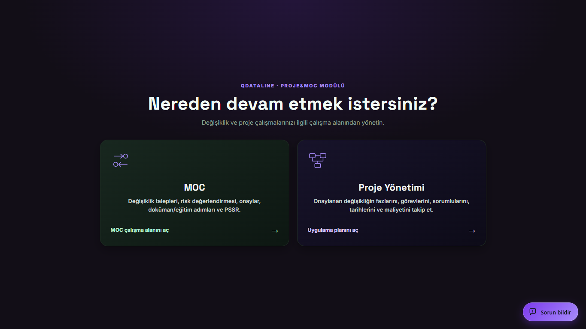
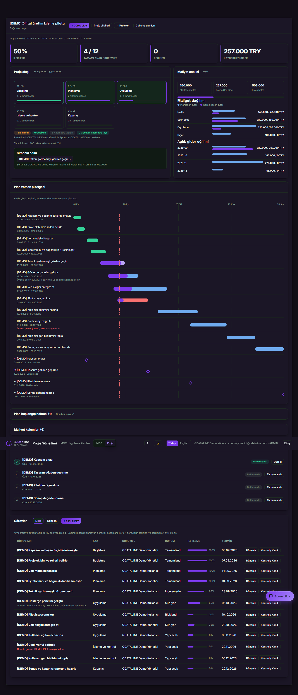
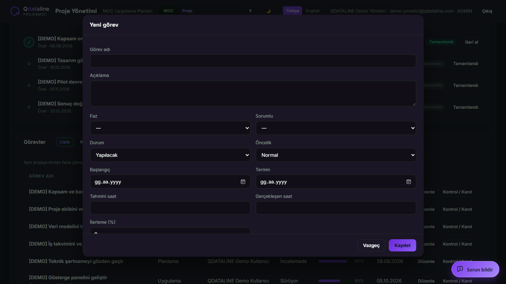
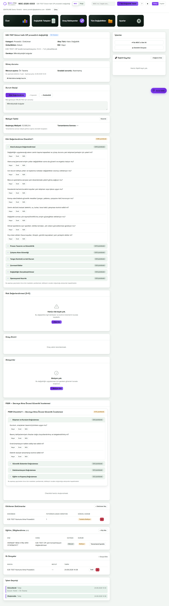
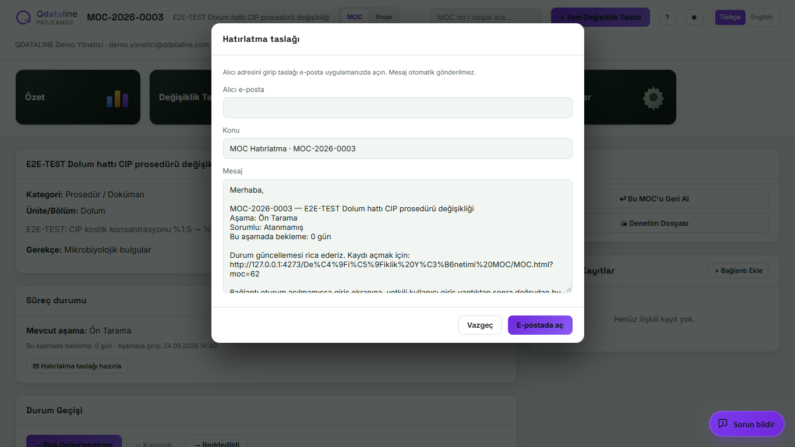

# Proje&MOC kullanıcı kılavuzu

Bu kılavuz, ilk kez kullanan birinin değişiklik talebi ile bağımsız proje arasındaki farkı, her ekranda ne yapacağını ve hangi işlemin sonrakini başlatacağını anlaması için hazırlanmıştır. Görseller demo verisiyle yerel önizlemeden alınmıştır.

## 1. Giriş ve çalışma alanı

Proje&MOC modülüne yetkili hesabınızla giriş yapın. İlk ekranda iki çalışma alanı vardır. **MOC**, değişiklik talebinin değerlendirme ve onay sürecidir. **Proje Yönetimi**, aynı talebin uygulama planı veya MOC’a bağlı olmayan bağımsız projeler içindir. Üstteki **MOC / Proje** düğmeleriyle geçiş yapabilirsiniz; geçişte her çalışma alanında son açtığınız ekran korunur.

## 2. Yeni proje ve görevler

**Proje → Yeni Proje Oluştur** ile bağımsız bir proje açabilir veya uygulama aşamasındaki bir MOC kaydına bağlı plan oluşturabilirsiniz. Bağımsız proje MOC onayı gerektirmeden başlar. Proje adı zorunludur; başlangıç ve hedef bitiş tarihi isteğe bağlıdır. Planı açınca başlıktaki **Görev ekle** düğmesi görünür. Her görev için ad, isteğe bağlı faz, sorumlu, durum, öncelik, başlangıç ve termin girin. Aynı projeye istediğiniz sayıda görev ekleyebilirsiniz. Başka bir görev tamamlanmasını gerektirmeyen işleri paralel yürütebilirsiniz; yalnız gerçek bir önkoşul varsa görevde **Bağımlılığı düzenle** kullanın.

Görevleri **Liste** veya **Kanban** görünümünde takip edin. Kanban, yapılacak, süren, incelemedeki, bloklanan ve tamamlanan işleri durumlarına göre gösterir. **Plan zaman çizelgesi** tarihli görevleri ve kilometre taşlarını gösterir. Görevde **Kontrol / Kanıt** alanına girilen kanıtlar ve tamamlanma koşulları görevin kapanışını destekler. Bir göreve bağlı önkoşul bitmeden o görevi sürüyor veya tamamlandı durumuna taşıyamazsınız. İş ilerledikçe gerçekleşen saat ve tamamlanma yüzdesini güncelleyin.

Proje açılışında ilk hedef tarihler otomatik korunur. Tarihi sonradan değiştirirseniz gerekçe yazmanız gerekir. Proje başlığının altında **İlk plan** ve **Güncel plan**, görev tablosunda ise değişmiş terminlerin altında **İlk termin** görünür. **Plan başlangıç noktası → Baz çizgi kaydet** kapsam, görev, sorumlu ve bütçe dahil karşılaştırma fotoğrafıdır; önemli kapsam kararlarında yeni sürüm kaydedin. Baz çizgi ilk tarih korumasının yerine geçmez.

## 3. Maliyet ve raporlama

Proje özetinde planlanan bütçe, kaydedilen gider ve kalan bütçe görünür. **Maliyet kalemleri** bölümüne işçilik, satın alma, dış hizmet, üretim duruşu veya diğer türden kalem ekleyin. Bir kalemin planlanan ve gerçekleşen tutarını, para birimini ve tarihini girin. Özet, maliyet dağılımını ve aylık gider eğilimini gösterir. Proje maliyeti kaydı MOC değişiklik talebinin onay akışını tek başına değiştirmez.

## 4. MOC akışı ve hatırlatma

**MOC → Yeni Değişiklik Talebi** ile taslak açın. Akış türü ve kategori seçimi, risk değerlendirme ve kontrol listesindeki ilgili maddeleri belirler. Talep sırasıyla ön tarama, risk değerlendirme, teknik inceleme ve onaydan geçer. Onaydan sonra uygulama, etkilenen dokümanlar, eğitim, gerekirse PSSR (Devreye Alma Öncesi Güvenlik İncelemesi), devreye alma ve kapanış izlenir. Ekrandaki geçiş düğmesi gerekli kayıtlar, yanıtlar ve açık aksiyonlar tamamlanmadığında ilerlemez; açıklama sebebi gösterir.

Kayıt ayrıntısındaki **Süreç durumu** alanı mevcut aşamayı, bilinen sorumluyu ve bu aşamada geçirilen gün sayısını gösterir. Bir onay adımında belirli kişi henüz atanmadıysa rol görünür; koordinatör veya sorumlu kaydı yoksa atanmadığı belirtilir. **Hatırlatma taslağı hazırla** ile alıcıyı seçip metni düzenleyin. Taslak bir e-posta uygulamasında açılır; otomatik gönderilmez. İçerikteki kayıt bağlantısı, oturumu kapalı kullanıcıyı önce giriş ekranına götürür ve yetkili girişten sonra ilgili MOC kaydını açar.

## 5. Yetki ve ayarlar

Görüntüleme, görev ekleme, görev düzenleme ve MOC onayı hesabın yetkilerine göre ayrılır. Projede görev ekleyebilen bir kullanıcı, başkasının görevini düzenleyemeyebilir; proje lideri, kurucu veya koordinatör düzenleme yapabilir. **Ayarlar → Kullanıcılar → MOC görev profili** kişinin süreçteki işlevini belirtir: saha operatörü uygulama, sorumlu takip, üst yönetim karar, denetçi inceleme. Bu etiket erişim yetkisi vermez. Yetki değişiklikleri ayrı kullanıcı yönetimiyle yapılır.

## Hızlı örnek

1. Bağımsız **Yeni Proje Oluştur** ile “Dolum hattı otomasyonu” projesini açın.
2. “Elektrik çizimini hazırla” ve “Yazılımı geliştir” görevlerini aynı proje içinde, aynı başlangıç haftasıyla ekleyin. İkisi paralel ilerler.
3. “Saha kabul testi” görevini ekleyin; yazılım görevi tamamlanmadan başlayamayacaksa bu göreve bağımlılık tanımlayın.
4. Satın alma ve işçilik maliyetlerini ayrı kalemler olarak girin. Plan zaman çizelgesi ile Kanban’ı birlikte izleyin.
5. Yazılım testinin terminini değiştirirken gerekçeyi yazın. İlk termin ekranda kalır; yeni bir baz çizgi kaydederek güncel kapsamı da sabitleyin.
