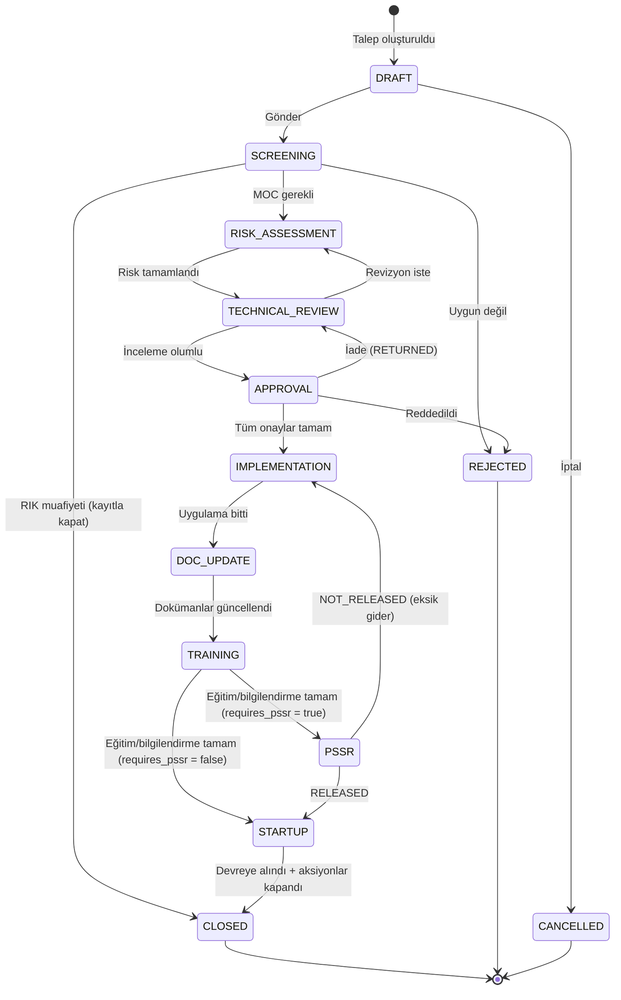

# MOC Durum Makinesi (State Machine) v1

> Referans: `moc_schema_v1.sql` → `moc_requests.status`
> Bu dosya workflow motorunun tek doğruluk kaynağıdır (single source of truth).
> Koda geçerken: geçiş matrisi bir config/JSON olarak service katmanına taşınır.

---

## 1. Mimari Not — API Stratejisi

- İç REST API (frontend ↔ backend) **Phase 1'de yazılır** (zorunlu).
- Dış/açık API (SAP, üçüncü parti) **ertelendi**; şu kurallarla kapı açık tutulur:
  - Katmanlı mimari: `controller → service → repository`. İş mantığı **sadece** service'te.
  - İleride dış API = yeni controller + API key middleware. Service değişmez.
  - Tenant ayarı: `external_api_enabled` (boolean, varsayılan `false`).

---

## 2. Ana Akış Diyagramı (Kalıcı / Geçici Değişiklik)



### Geçici Değişiklik Ek Kuralı
`CLOSED` sonrası izleme devam eder: `moc_temporary_tracking.expires_at` dolmadan
**eski duruma dönüş** (`restored_at`) kaydedilmeli; dolarsa eskalasyon + uzatma akışı.
Uzatma = yeni mini-onay (`moc_approvals`'a ek satır), MOC yeniden açılmaz.

### PSSR Gerektirmeyen Türler (RIK / MOOC / Procedural)
`moc_types.requires_pssr = false` olan akış türlerinde PSSR adımı hiç
görünmez/atlanmaz: `TRAINING` durumundan doğrudan `STARTUP`'a geçilir
(kod: `MOC.html` `TRANSITIONS.TRAINING` — `requires_pssr` koşuluna göre
`PSSR` veya `STARTUP` hedefi seçilir). PSSR checklist'i hiç oluşturulmaz,
ilgili panel gösterilmez.

### Acil Değişiklik Farkı
Acil akışta sıra değişir: `DRAFT → IMPLEMENTATION (sözlü ön onayla) → geriye dönük
RISK_ASSESSMENT → APPROVAL → ...` Geriye dönük dosya `moc_types.retro_hours`
(varsayılan 72 saat) içinde tamamlanmalı; aşılırsa koordinatöre eskalasyon.

---

## 3. Geçiş Matrisi (koda taşınacak config)

| Mevcut Durum | Hedef Durum | Koşul | Kim (izin) |
|---|---|---|---|
| DRAFT | SCREENING | Zorunlu alanlar dolu; geçici ise `planned_end` dolu | Talep sahibi (`moc.create`) |
| DRAFT | CANCELLED | — | Talep sahibi, Koordinatör |
| SCREENING | RISK_ASSESSMENT | Kategori + akış türü atandı | Koordinatör (`moc.screen`) |
| SCREENING | CLOSED | `is_rik = true`, tarama formu dolu | Koordinatör |
| SCREENING | REJECTED | Gerekçe zorunlu | Koordinatör |
| RISK_ASSESSMENT | TECHNICAL_REVIEW | ≥1 risk kaydı var; yüksek risk (≥15) için önlem alanı dolu | HSE (`moc.risk`) |
| TECHNICAL_REVIEW | APPROVAL | İnceleme notu girildi | Teknik ekip (`moc.review`) |
| TECHNICAL_REVIEW | RISK_ASSESSMENT | Revizyon gerekçesi | Teknik ekip |
| APPROVAL | IMPLEMENTATION | Zincirdeki tüm `step_order` onayları `APPROVED` | Sistem (otomatik) |
| APPROVAL | REJECTED | Herhangi bir adım `REJECTED` | Sistem (otomatik) |
| APPROVAL | TECHNICAL_REVIEW | Bir adım `RETURNED` | Sistem (otomatik) |
| IMPLEMENTATION | DOC_UPDATE | `phase=IMPLEMENTATION` aksiyonların tümü `DONE` | Koordinatör |
| DOC_UPDATE | TRAINING | Etkilenen dokümanlar (`AFFECTED_DOC`) yeni sürüm aldı | Koordinatör |
| TRAINING | PSSR | Tüm `moc_trainings.acknowledged = true`; tür `requires_pssr = true` | Koordinatör |
| TRAINING | STARTUP | Tüm `moc_trainings.acknowledged = true`; tür `requires_pssr = false` (PSSR atlanır) | Koordinatör |
| PSSR | STARTUP | Checklist `result = RELEASED` | PSSR ekibi (`moc.pssr`) |
| PSSR | IMPLEMENTATION | `result = NOT_RELEASED` | PSSR ekibi |
| STARTUP | CLOSED | Açık aksiyon yok (POST_STARTUP dahil) | Koordinatör (`moc.close`) |

**Genel kurallar:**
- Matris dışı her geçiş **reddedilir** (HTTP 409 + geçerli hedef listesi döner).
- Her geçiş `moc_audit_log`'a otomatik yazılır (trigger zaten var).
- `CLOSED / REJECTED / CANCELLED` terminal durumlardır; yeniden açma yalnız
  Sistem Yöneticisi tarafından, gerekçeli (`moc.reopen` izni) yapılabilir.

---

## 4. Koda Geçiş — Önerilen Yapı

```js
// src/modules/moc/moc.transitions.js
// Geçiş matrisi config olarak — controller değil, SERVICE katmanı kullanır.
module.exports = {
  DRAFT:            { SCREENING: 'moc.create', CANCELLED: 'moc.create' },
  SCREENING:        { RISK_ASSESSMENT: 'moc.screen', CLOSED: 'moc.screen', REJECTED: 'moc.screen' },
  RISK_ASSESSMENT:  { TECHNICAL_REVIEW: 'moc.risk' },
  TECHNICAL_REVIEW: { APPROVAL: 'moc.review', RISK_ASSESSMENT: 'moc.review' },
  APPROVAL:         { IMPLEMENTATION: 'system', REJECTED: 'system', TECHNICAL_REVIEW: 'system' },
  IMPLEMENTATION:   { DOC_UPDATE: 'moc.coordinate' },
  DOC_UPDATE:       { TRAINING: 'moc.coordinate' },
  TRAINING:         { PSSR: 'moc.coordinate' },
  PSSR:             { STARTUP: 'moc.pssr', IMPLEMENTATION: 'moc.pssr' },
  STARTUP:          { CLOSED: 'moc.close' },
};
```

Service katmanında tek bir `transition(mocId, targetStatus, userId)` fonksiyonu:
1. Matristen geçiş var mı kontrol et → yoksa 409
2. İzin kontrolü (RBAC) → yoksa 403
3. Koşul kontrolleri (tabloda "Koşul" sütunu) → sağlanmıyorsa 422 + eksik listesi
4. Durumu güncelle (audit trigger devreye girer) + bildirim kuyruğuna iş at

---

*Sürüm: v1 — 21.07.2026 · Sıradaki dosya: iç API endpoint listesi (Phase 1 kapsamı).*
